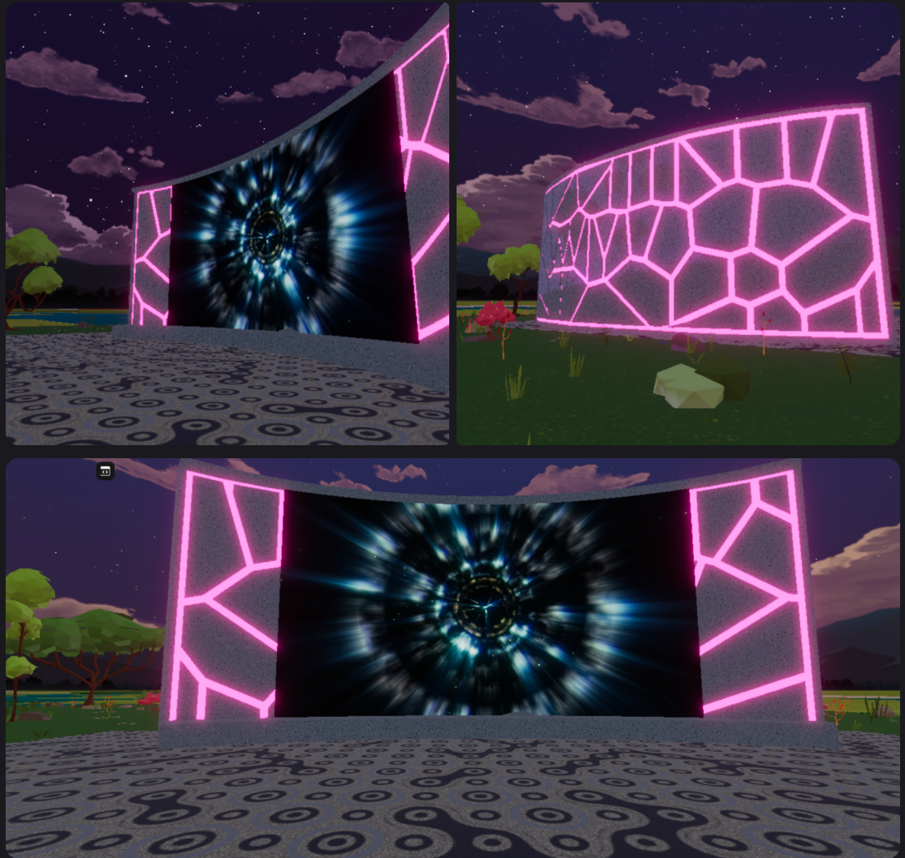

# The Configurable Curved Screen

Welcome! This repository is the official project for the Decentraland Creator Academy's advanced workshop series, hosted by MrJStickel. It contains a complete, working Decentraland scene that demonstrates how to build a flexible, curved video screen component from scratch by arranging primitive shapes.

This project is designed as a learning tool for intermediate developers, illustrating key SDK 7 concepts with practical, modular code.

---

## ✨ Features

* **Configurable Curve:** The screen's curve can be easily adjusted in the code via a `curveFactor` parameter, allowing for anything from a flat display to a deeply immersive curve.
* **Procedural Arrangement:** The screen is built by arranging 22 individual segments in a loop, a powerful technique for creating complex shapes.
* **Dynamic UV Mapping:** Each segment's UVs are calculated dynamically to create a single, seamless image across the entire screen.
* **Custom 3D Frame:** The scene includes a custom-modeled `.glb` frame that the coded screen fits perfectly inside.

---

## 🚀 Getting Started

To run this scene, clone the repository, navigate into the project directory, and run the following commands in your terminal:

    # Install project dependencies
    npm install

    # Start the local development server
    dcl start

---

## 📚 SDK 7 Concepts in this Scene

This project is a practical example of several key SDK 7 concepts:

* **Modular Code:** The logic is separated into a reusable `createCurvedScreen` function in `curved-screen.ts` and the main scene setup in `index.ts`.
* **Component Configuration:** The `CurvedScreenOptions` interface demonstrates how to create flexible components that can be configured with different parameters.
* **Procedural Logic:** Using loops and mathematical formulas (`calculateSegmentTransform`) to generate complex arrangements of entities.
* **Custom 3D Model Integration:** Using the `GltfContainer` component to import and use custom models created in Blender.